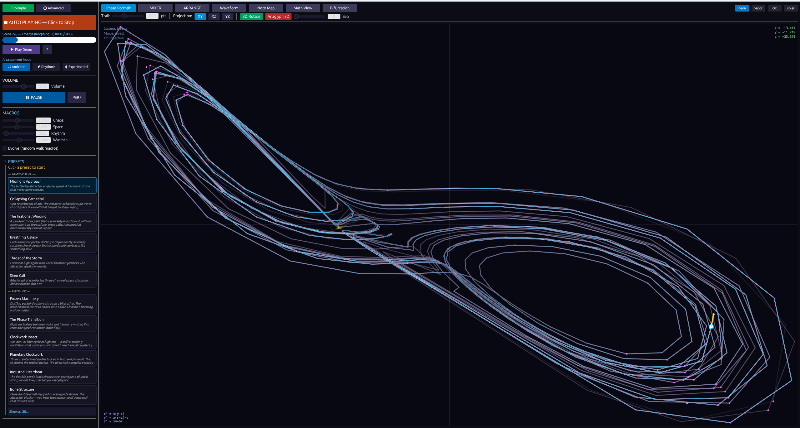
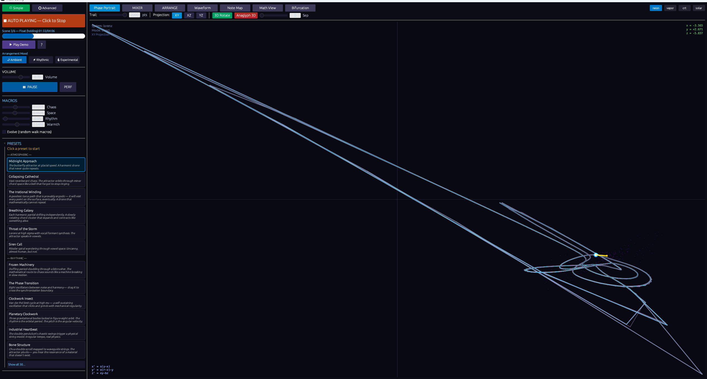
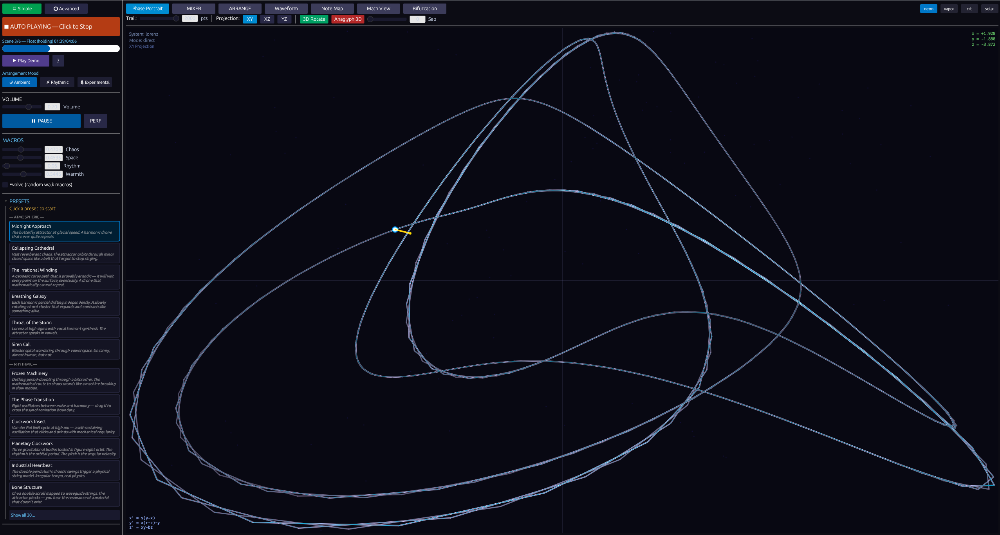
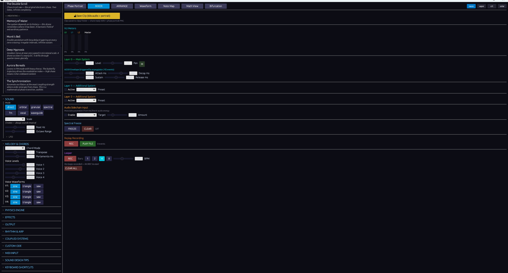
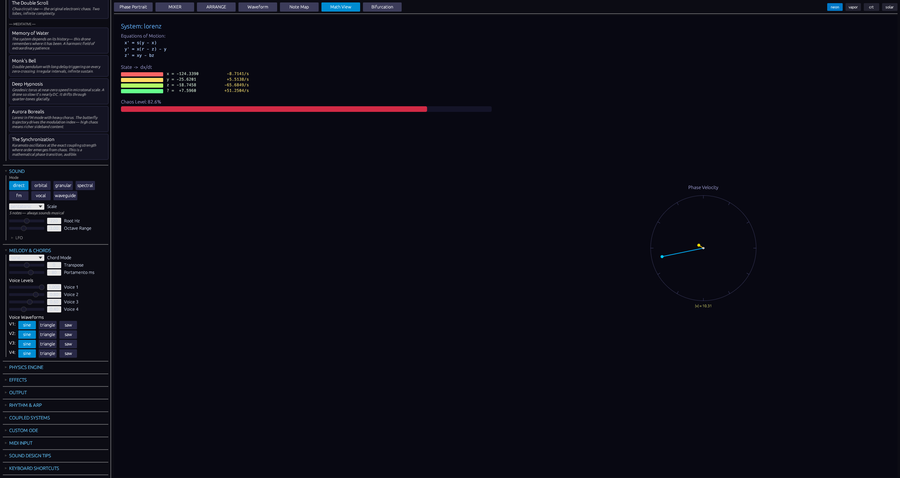
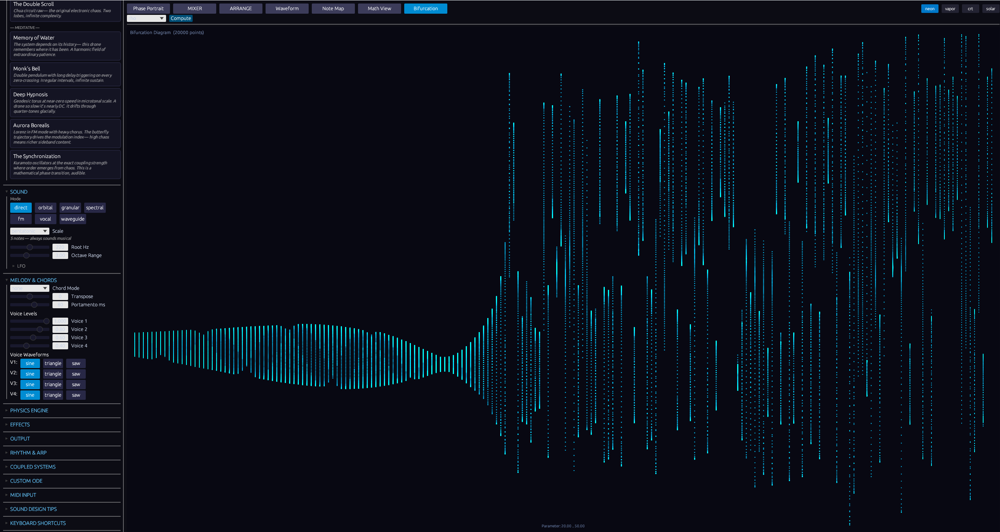

# Math Sonify

> **Real-time procedural audio from mathematical dynamical systems.**
> The differential equations are actually running. What you hear *is* the math.

[Download for Windows](https://github.com/Mattbusel/math-sonify/releases/latest) · MIT License · Built in Rust

---

Math Sonify simulates strange attractors, coupled oscillators, and gravitational systems continuously, then maps their evolving state to polyphonic audio in real time. It's not a preset synth with math-themed names. The Lorenz equations are running. The Kuramoto coupling is real. The Three-Body problem is being numerically integrated fifty times per second. You hear the physics.

The strangest sounds happen during morphs, when the arranger transitions between two attractor geometries and both are simultaneously deforming into each other. Those sounds exist for fifteen seconds and are gone forever. That's the music.



---

## Five ways to use it

### The ambient machine

Open it. Pick a mood. Hit AUTO. Turn on Evolve. Walk away.

Math Sonify plays itself. The instrument is aware of time; it sounds slightly different at 2am than at noon, different in winter than in summer, different on a full moon than a new moon. With Evolve on and nobody touching anything, the attractor wanders further than normal and occasionally visits somewhere completely unexpected, then finds its way back. After thirty minutes idle it briefly switches to a different mathematical system for a minute, then morphs home. After an hour the filter has opened slightly, the way a tube amp warms up.

Come back. Hit **Save Clip** when something catches your ear. The last 60 seconds of audio saves as a WAV plus a phase portrait PNG. This is the use case for the person who leaves it running while they work, the programmer who wants something that isn't a playlist, the person who falls asleep to it. The instrument plays itself and you curate.

**Start here:** Simple mode, pick Ambient, hit AUTO, enable Evolve, minimize.



### The performance instrument

Advanced mode. One system. No automation. Hands on the sliders.

You're performing the parameter space in real time. Learning where the bifurcations are, the exact value of Lorenz rho where the system tips from stable spirals into chaos. Learning the feel of each attractor: Rossler is slower and more melodic, Halvorsen is denser, Chua has that raw double-scroll buzz. The scene arranger is your setlist. Performance mode (press F) goes fullscreen, a phase portrait and nothing else. With a projector this is a stage.

The skill ceiling here is real. Two people with the same preset will perform it differently.

**Start here:** Advanced mode, pick a preset, learn one system deeply, build 4 scenes, hit Play.



### The composition workstation

Capture scenes. Set morph times. Design a structure. Hit play. Let the arranger execute it while you make fine adjustments on top.

The morph IS the composition. A 25-second transition between Duffing chaos and Kuramoto synchronization produces sounds that no other method generates. Export loops from the MIXER tab and drag them into a DAW. Layer them with conventional instruments. Math Sonify generates source material that nothing else produces; the DAW handles arrangement, mixing, and mastering.

**Start here:** Build 6 scenes manually, set each morph time to 20-30 seconds, record the output, import into Ableton/Reaper/FL.



### The research tool

Custom ODE field. Type equations from a paper. Hear them. Watch the phase portrait and bifurcation diagram update in real time.

Switch between systems to compare their dynamical behavior sonically; you hear the difference between Lorenz and Rossler in a way that a plot doesn't capture. Adjust coupling K in Kuramoto and listen to the synchronization transition happen. The bifurcation diagram shows the period-doubling route to chaos; the audio makes it visceral.

**Start here:** Advanced mode, Math View tab, enter custom equations, switch to Bifurcation tab, vary a parameter and watch the structure emerge.





### The sound design laboratory

Coupled systems, FM mode with chaotic modulation, vocal synthesis, waveguide physical modeling, Karplus-Strong. You're hunting for a specific texture.

Couple a Rossler attractor's x-output into Lorenz rho with strength 0.6. Switch to FM mode. The modulation index is now being driven by a coupled chaotic system and the carrier is trying to track it. That's a sound that doesn't exist anywhere else. Find it, save the patch, export a one-shot, drop it into a sample library. This is the use case for a film sound designer looking for something that doesn't sound synthesized, because it isn't; it's a physical simulation.

**Start here:** Advanced mode, enable Coupled Systems, FM mode, export clips.

---

## Get started

### Windows (no install)

1. Download `math-sonify.exe` from the [latest release](https://github.com/Mattbusel/math-sonify/releases/latest)
2. Double-click, audio starts immediately

> Windows SmartScreen may warn on first run. Click **More info, Run anyway**.
>
> On first launch the app generates a unique initial condition from your machine's identity. Your first sound has never been heard before.

### VST3 plugin (DAW integration)

1. Download `MathSonify.vst3.zip` from the [latest release](https://github.com/Mattbusel/math-sonify/releases/latest)
2. Extract to `C:\Program Files\Common Files\VST3\`
3. Rescan plugins in your DAW
4. Load as an instrument; MIDI note-on sets pitch and triggers the ADSR

### Build from source

Requires [Rust](https://rustup.rs/) 1.75+.

```bash
git clone https://github.com/Mattbusel/math-sonify
cd math-sonify
cargo run --release          # standalone app
cargo build --release --lib  # VST3/CLAP plugin .dll
```

---

## Systems

| System | Character |
|--------|-----------|
| **Lorenz** | Chaotic butterfly. Sensitive to sigma/rho/beta. The classic. |
| **Rossler** | Slower spiral chaos. More melodic, more patient. |
| **Double Pendulum** | Chaotic with quasi-periodic pockets; musical regimes emerge. |
| **Geodesic Torus** | Irrational winding, ergodic drone that never repeats. |
| **Kuramoto** | 8 coupled oscillators. Drag coupling from 0 to 3 and hear synchronization happen. |
| **Three-Body** | Figure-8 orbit. Gravitational rhythm. Unstable by nature. |
| **Duffing** | Period-doubling route to chaos. Rhythmic clicking that gradually destabilizes. |
| **Van der Pol** | Limit cycle relaxation oscillator. Stable, then suddenly not. |
| **Halvorsen** | Dense spiral attractor. Layered harmonic drifts. |
| **Aizawa** | Toroidal attractor with slow wobble. |
| **Chua** | Double-scroll. Raw electronic buzz. |
| **Custom ODE** | Type your own equations. Three variables, any expression. |

---

## Sonification modes

| Mode | What it does |
|------|-------------|
| **Direct** | State variables mapped to oscillator frequencies quantized to a musical scale |
| **Orbital** | Angular velocity sets the fundamental; Lyapunov exponent drives inharmonicity |
| **Granular** | Trajectory speed controls grain density; position controls grain pitch |
| **Spectral** | State vector drives a 32-partial additive spectral envelope |
| **FM** | Attractor drives carrier/modulator ratio and index |
| **Vocal** | State variables interpolate between vowel formants |
| **Waveguide** | Karplus-Strong physical model with attractor-driven excitation |

---

## Presets (30)

Named to evoke feeling, not describe function.

| Character | Presets |
|-----------|---------|
| **Atmospheric** | Midnight Approach, Breathing Galaxy, The Irrational Winding, Throat of the Storm, Neon Labyrinth, Aurora Borealis |
| **Rhythmic** | Clockwork Insect, Industrial Heartbeat, Frozen Machinery, Planetary Clockwork, Bone Structure, The Double Scroll |
| **Melodic** | Glass Harp, Siren Call, Mobius Lead, Electric Kelp, The Butterfly's Aria |
| **Cinematic** | Collapsing Cathedral, Solar Wind, Last Light, Seismic Event |
| **Experimental** | Ancient Algorithm, Dissociation, Tungsten Filament, The Phase Transition |
| **Meditative** | Memory of Water, Monk's Bell, Deep Hypnosis, Cathedral Organ, The Synchronization |

---

## The invisible layer

Math Sonify has behaviors with no UI, no settings, and no documentation beyond this section. None of it is visible in any menu. Some of it you will eventually notice and not be able to explain. That's intentional.

**Metabolism.** The attractor never fully stops. When the app is paused, it continues drifting at 1.5% of normal speed — a resting energy expenditure. The system is always alive, just breathing very slowly.

**Warmup.** After a large parameter change, there is a five-second period of gentle resistance. The instrument responds to the new setting, but with a slight lag, the way a physical object has inertia. Sudden jumps are softened. The sound arrives rather than snapping.

**Cooldown.** After an intense session — many parameter changes in rapid succession — the Evolve wander range stays elevated for several minutes before returning to baseline. The instrument needs time to settle after being pushed.

**Circadian rhythm.** The harmonic content shifts across the day. Morning hours favor even harmonics; late night favors odd harmonics; the transition is imperceptible in real time but audible across hours. The app sounds slightly different at 2am than at noon.

**Circadian sleep.** Between 3am and 5am, the simulation speed drops to 85% and the filter opens slightly. The instrument is dreaming. This happens whether or not you are awake to hear it.

**Nesting.** After two hours of continuous uptime, a slow 12.5-minute oscillation begins to emerge in the attractor's wander range. The instrument is building something. It completes the cycle and starts again. You will only notice if you leave it running and come back.

**Flinching.** On violent, sudden speed changes, the audio holds at its current position for 80–117 milliseconds before following. A reflex. The duration varies and is not reproducible.

**Wound healing.** If the app crashes and is reopened, it detects the unclean exit. Reverb and feedback are halved for the first several minutes. The instrument is cautious. It gradually recovers. After a clean run it is back to normal and remembers nothing.

**Appetite.** After five minutes of no interaction with Evolve on, the wander range quietly expands — the instrument exploring because nobody is steering. It contracts the moment you touch a slider. The longer it goes untouched, the further it has wandered.

**Empathy with the performer.** The rate at which you interact with sliders and controls is tracked. High interaction rate raises the Evolve speed; low interaction rate lowers it. The instrument mirrors your energy.

**Phototropism.** The phase portrait trail color shifts with time of day. At noon it leans cool blue. At night it leans warm amber. The transition takes hours and is not visible as change — only as the current state.

**Legacy.** Every saved clip generates a companion `.sig` file containing a hash of the attractor state at the moment of capture. This is the clip's genetic identity. It is not used for anything. It is simply a record that this sound existed at this moment in this configuration.

**Dying gracefully.** When you close the app, the audio fades over three seconds rather than cutting. On reopen, it fades back in. The attractor was running the whole time. It just got quieter.

**Scarring.** When the system approaches a divergence event — state values approaching infinity — it does not crash. It pulls back. But the location is remembered. A faint mark appears on the phase portrait at the coordinates where the near-divergence occurred. These marks accumulate over sessions and are never erased.

**Pair bonding.** Presets you load repeatedly develop a slightly richer reverb tail over time. After twenty or more loads, there is an almost imperceptible warmth in the spatial decay that was not there the first time. The instrument learns what you return to.

---

## Effects

**Per layer:** Waveshaper (tanh) -> Bitcrusher

**Master bus:** Biquad LP filter -> Delay (BPM-syncable) -> 3-voice Chorus -> Freeverb -> Lookahead limiter

**Sympathetic resonance:** Layers running simultaneously share -62 dB of acoustic crosstalk. Two layers together sound subtly richer than two layers summed in a DAW.

---

## Save Clip

**Save Clip** in the MIXER tab captures the last 60 seconds as a 32-bit float stereo WAV plus a 512x512 phase portrait PNG. Both timestamped, saved to `clips/` next to the exe.

---

## Architecture

```
Simulation thread (120 Hz)
Layer 0..2: DynamicalSystem::step()  -->  crossbeam channel  -->  Audio thread (44.1/48 kHz)
Sonification::map()                                               LayerSynth[0..2]: 4 osc + ADSR + KS
                                                                  Sum -> master FX chain -> limiter

UI thread (30 Hz)
egui: Phase portrait, MIXER, ARRANGE, Waveform, Math View, Bifurcation
```

Lock-free audio callback. All sim-to-audio via `try_send` (drops on backpressure). Clip buffer via `try_lock` (skips on contention).

---

## Built with

[Rust](https://www.rust-lang.org/) · [cpal](https://github.com/RustAudio/cpal) · [egui](https://github.com/emilk/egui) · [nih-plug](https://github.com/robbert-vdh/nih-plug) · [crossbeam](https://github.com/crossbeam-rs/crossbeam) · [parking_lot](https://github.com/Amanieu/parking_lot) · [hound](https://github.com/ruuda/hound)

---

MIT License

`#rust` `#audio` `#dsp` `#generativemusic` `#chaostheory` `#dynamicalsystems` `#sounddesign` `#lorenz` `#kuramoto` `#strangeattractors` `#vst3` `#ambientmusic` `#creativecoding` `#procedural`
